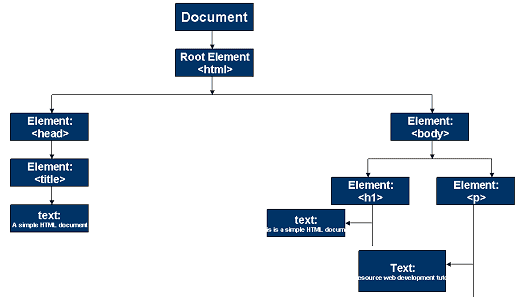

# JavaScript - Continuação

Vamos recomeçar, dessa vez seguindo o [tutorial da W3 Schools](https://www.w3schools.com/js/default.asp).

---

## Nota rápida sobre DOM

`DOM` (*Document Object Model*), ou Modelo de Documento de Objetos em tradução livre, é uma interface que permite a scipts e programas acessarem e atualizarem conteúdos (ex.: texto, imagem, etc.), estrutura e estilo de documentos HTML, XHTML e XML de forma dinâmica.

O documento é tratado como uma árvore onde cada nó representa uma parte do documento. Quando um navegador carrega um arquivo HTML, esse documento é transformado em um Documento de Objetos. A partir disso é possível acessar, manipular e formatar os elementos com JavaScript e CSS, através do elemento `<script>`.

Exemplo de um documento HTML e seu DOM correspondente:

```html
<!DOCTYPE html>
<html lang="pt-bt">
    <head>
        <meta charset="utf-8">
        <title>Um documento HTML simples</title>
    </head>
    <body>
        <h1>Este é um documento HTML simples</h1>
        <p>Tutorial traduzido e adaptado de w3resource</p>
    </body>
</html>
```



---

## Introdução

Vejamos algumas possibilidades que o JavaScript fornece aos programadores.

1. Modificar conteúdo de um documento HTML: [exemplo 01](exemplo01.html).
2. Modificar os valores dos atributos em um documento HTML: [exemplo 02](exemplo02.html).
3. Modificar o estilo do HTML (CSS): [exemplo 03](exemplo03.html).
4. Apagar/esconder elementos HTML: [exemplo 04](exemplo04.html).
5. Fazer aparecer elementos HTML: [exemplo 05](exemplo05.html).

---

## Onde inserir o código do JavaScript

Em um documento HTML, o código JavaScipt é inserido entre as tags `<script>` e `</script>`. Exemplo:

```html
<script>
    document.getElementById("demo").innerHTML = "Meu primeiro JavaScript";
</script>
```

Exemplos antigos de `JavaScript` utilizam o atributo `type`: `<script type="text/javascript">`. Este atributo pode ser omitido, uma vez que o JavaScript é a linguagem de script padrão do HTML.

Contanto que esteja dentro da tag `<script>`, o código do `JavaScript` pode ser adicionado no `head` e/ou no `body`. E de forma similar ao CSS, em vez de ter o código dentro do documento HTML, o código pode estar em uma arquivo separado (.js) e ser chamado em uma tag `<script>`.

* [JS no head](exemplo06.html).
* [JS no body](exemplo07.html).
* Um script externo pode ser referenciado de 3 formas diferentes:
  * [Através de uma URL (endereço web)](exemplo08.html).
  * Através de um caminho de arquivo completo (ex.: /js/arquivo.js).
  * Somente o nome do arquivo, sem o caminho (ex.: arquivo.js). Nesse caso espera-se que o arquivo esteja na mesma pasta que o documento HTML.

---

## Saída (output) do JavaScript

Existem algumas possibilidades para apresentar uma saída com JavaScript:

* Escrevendo em um elemento HTML usando `innerHTML`: [exemplo 09](exemplo09.html).
* Escrevendo na saída do HTML usando `document.write()`: [exemplo 10](exemplo10.html).
  * Usar `document.write()` após um documento HTML ser carregado faz com que todo o HTML seja apagado: [exemplo 11](exemplo11.html).
* Escrevendo em uma caixa de alerta usando `window.alert()` : [exemplo 12](exemplo12.html).
  * A palavra reserva `window` pode ser omitida. Isso acontece porque o `objeto window` é o objeto de escopo global (lembra do DOM?). Ou seja, as variáveis, propriedades e métodos pertencem ao `objeto window` por padrão.
* Escrevendo no console do navegador usando `console.log()`: [exemplo 13](exemplo13.html).

O JavaScript não possui qualquer método ou objeto `print`. Por isso não é possível acessar dispositivos de saída a partir do JavaScript. A única exceção é o método `window.print()` no navegador para imprimir o conteúdo da aba/janela aberta.

---

## Continuação

Por enquanto continuemos pelo site do [W3Schools](https://www.w3schools.com/js/js_statements.asp).